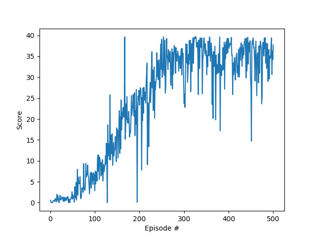

# Overview
Part of the Deep Reinforcement Learning Nano Degree(drlnd) from Udacity.
In this project you are tasked to train an two jointed arm to follow an green sphere in the unity environment around this arm.
The sphere seems to be on the same distance and height but circles around the center of the arm in different directions and speeds.

The basic structure of this architecture (model, agent, training, ...) was taken from the Udacity examples given to us.

This project is set up on Linux, if you want to use it on another platform look at the Setup to get your individual Unity environment running and replace it in the code(train.py) and folder(Reacher_Linux) appropriately.

# Setup
To start, you need Python 3.6, PyTorch, Numpy, Matplotlib, and the Unity ML-Agents Toolkit.

With Anaconda or virtualenv you can create your python environment like:
conda create -n drlnd python=3.6 pytorch matplotlib

For the Unity ML-Agent you need to download the Toolkit (https://github.com/Unity-Technologies/ml-agents) go to the ml-agents/python directory and install it via:
    $pip install ml-agents/python

    
# Instructions

Watch the trained agent with:
$ python watch.py

and let the agent train again with:
$ python train.py

# Environment

The environment is from unity.
In this environment you control an two jointed arm fixed to one location.
Around you is a green sphere that you need your "fist" of the arm to be inside of this sphere to get rewards.
If you are inside the sphere you get an reward, if you are outside you get an reward of zero.
The environment ends after around 1000 timesteps.

The observation state size is 33 and the action size is four.
For the action size you control both joints with horizontal and vertical movements from -1 to +1. That is why the action size of four is enough to control the arm.

The task is episodic and the environment is considered solved after getting a score of +30 over the last 100 consecutive episodes.

Below is the reward chart of my successful algorithm. It solved the environment with +30 at around 250 episodes.

# Archtitecture

The architecture used is a DDPG. This architecture consists of an actor and an critic. 
This architecture is used because it can predict actions in an continuous action space.
Both models are set up with 2 hidden layers. The first hidden layer has the size 400 and the second the size 300.

# Algorithms

Fixed Target Q-Network for both the critic and the actor.
DDPG as mentioned.
The "20/10" trick, in which you only update the model every 20 steps, but then with 10 experiences at once.
Batch regularization 2 (L2) with weight decay of 0.00001, which was used to prevent overfitting of the agent.
Experience Replay.

# Future

The agent so far is pretty good in a very short learning cycle.
Although additional improvements can be made, like the Generalized Advantage Estimation(GAE) to improve the prediction of the expected return.
